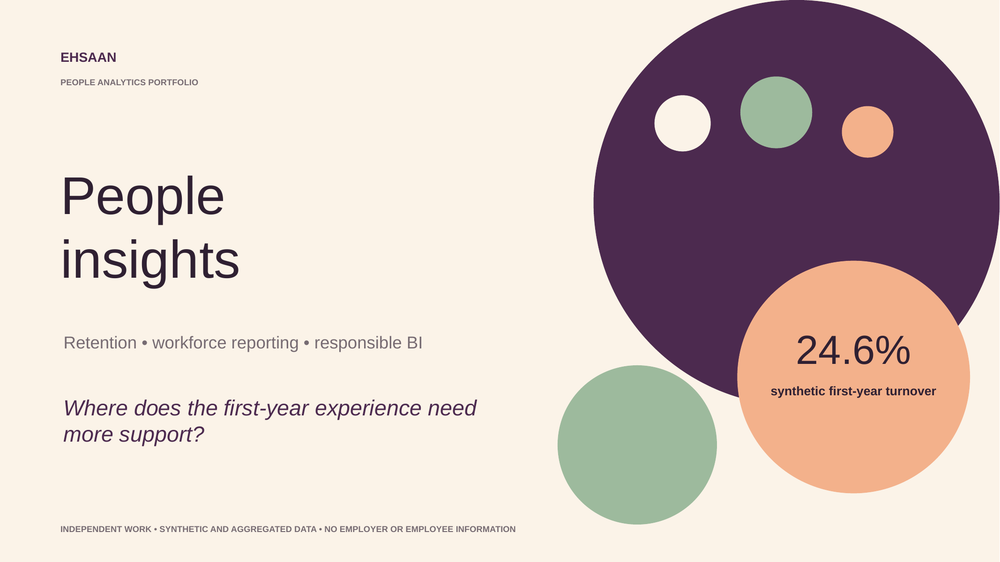

# People Analytics Case Study

## First-Year Turnover, Responsible Workforce Insight and Retention Support

This independent portfolio project examines where the first-year employee experience may need additional support and how aggregated workforce data can guide a fair, testable retention response.

The case study combines workforce segmentation, privacy-aware analysis, reporting automation and visible human-review safeguards.

[**View the complete People Analytics case study (PDF)**](Ehsaan-Khan-People-Analytics-Case-Study.pdf)

> **Portfolio disclosure:** This project uses entirely synthetic and aggregated data. It contains no employer or employee information. Financial benefits are illustrative planning scenarios, not realised outcomes.

## Business Question

**Which workforce groups are contributing most strongly to avoidable turnover, and where should retention action begin without applying a blanket policy?**

The intended audience is people leadership, operations and workforce planning.

## Workforce Dataset and Model

| Workforce element   |                                                  Scope |
| ------------------- | -----------------------------------------------------: |
| Monthly snapshots   |                                                     12 |
| Employees           |                                                  1,240 |
| Voluntary exits     |                                                    183 |
| Model grain         |                              Employee snapshot × month |
| Analysis dimensions | Date, organisational unit, role, shift and tenure band |
| Data classification |                          100% synthetic and aggregated |

## Key Findings

* Overall voluntary turnover reached **14.8%**, an increase of 1.6 percentage points year on year.
* First-year turnover reached **24.6%**, the highest rate across all tenure bands.
* The overall absence rate was **4.2%**.
* The tenure analysis showed that the strongest retention signal appeared within an employee’s first 12 months.

## Priority Group

The clearest aggregated signal appeared in:

**Customer Operations → Under 12 Months’ Tenure → Evening Shift**

* Voluntary turnover reached **31.4%**.
* The group accounted for **18.6% of voluntary exits** while representing only **9.2% of headcount**.
* Its turnover rate was approximately **2.1 times the portfolio average**.
* Its share of exits was roughly twice its share of headcount.

This signal identifies where additional support could be tested. It should not be used to make decisions about individual employees.

## Recommended 90-Day Support Pilot

I would begin with a focused support journey rather than a blanket policy:

| Stage  | Proposed action                                   |
| ------ | ------------------------------------------------- |
| Day 0  | Confirm clear role and shift expectations         |
| Day 30 | Hold a structured manager check-in                |
| Day 60 | Conduct a stay conversation                       |
| Day 90 | Review the emerging pattern and adapt the support |

The pilot should measure onboarding experience, retention and voluntary exits before any wider rollout.

## Responsible Analytics Safeguards

* Use aggregated trends to guide conversations, not individual employment decisions.
* Suppress results for groups that fall below an agreed minimum size.
* Restrict detailed workforce data according to role and business need.
* Exclude protected characteristics from intervention targeting.
* Retain human review at every interpretation and decision stage.
* Begin with support, listen to context and measure outcomes fairly.

A scenario model indicated approximately **£84,000 of potential cost avoidance** if 12 exits were prevented at an assumed cost of £7,000 per exit. This is an illustrative planning scenario and not a realised saving.

## Reporting Automation

The proposed reporting workflow reduces repetitive manual handling while preserving privacy controls and analyst judgement.

| Workflow                     |        Processing time |
| ---------------------------- | ---------------------: |
| Manual reporting process     |     3 hours 10 minutes |
| Controlled refresh           |             38 minutes |
| Capacity returned            |  152 minutes per cycle |
| Illustrative annual capacity | Approximately 61 hours |

Human review remains at privacy checks, exception handling and narrative commentary.

## Tools and Techniques Demonstrated

* Power BI report and KPI design
* Power Query workflow design
* Workforce and retention analysis
* Dimensional data modelling
* Reporting automation
* Privacy-aware aggregation
* Data-quality and access controls
* Decision-focused stakeholder communication

## Approach

**Listen to context → Make safeguards visible → Focus the action → Test fairly → Review before scaling**
